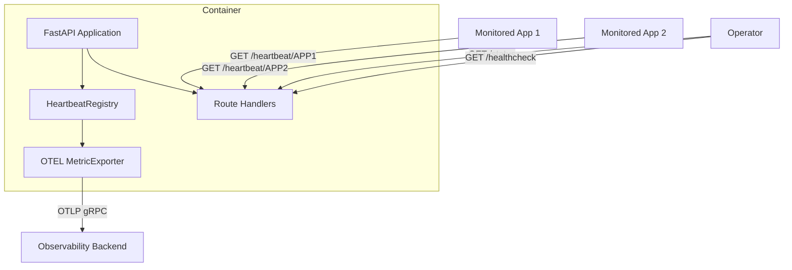

# Design Document

## Overview

The Heartbeat Monitor is a lightweight Python HTTP service that tracks the liveness of external applications. Each monitored application is configured via environment variables, specifying a name and an expected heartbeat interval. Applications send periodic `GET` requests to their designated `/heartbeat/{name}` endpoint. The service tracks the last-seen timestamp for each application and periodically exports an OpenTelemetry gauge metric (`1` = up, `0` = down) to a configurable OTLP endpoint.

The service also exposes utility endpoints: `/healthcheck` for container liveness probes and `/status` for human-readable JSON output of all monitored applications.

### Key Design Decisions

- **FastAPI** is chosen as the HTTP framework for its async support, automatic request validation, and low boilerplate.
- **OpenTelemetry Python SDK** with the OTLP gRPC exporter is used for metric reporting. An `ObservableGauge` with a callback pattern allows the SDK's periodic reader to pull current status values on each export cycle.
- **In-memory state only** — no database or persistent storage. The service starts with all applications in "down" state and only transitions to "up" upon receiving heartbeats.
- **Configuration at startup** — environment variables are parsed once at startup. Adding/removing applications requires a restart.

## Architecture



### Request Flow

1. Monitored applications send `GET /heartbeat/{name}` periodically.
2. The route handler validates the name against registered endpoints and updates the last-seen timestamp in the `HeartbeatRegistry`.
3. The OpenTelemetry SDK's `PeriodicExportingMetricReader` invokes the gauge callback at a configurable interval (≤60s).
4. The callback reads current timestamps from the registry, computes up/down status, and yields `Observation` values.
5. The metric reader exports observations to the OTLP endpoint.

## Components and Interfaces

### 1. Configuration Module (`config.py`)

Responsible for parsing environment variables at startup.

```python
@dataclass
class AppConfig:
    name: str                # Application_Name (from env var suffix)
    interval_seconds: int    # Heartbeat_Interval (env var value)

@dataclass
class ServiceConfig:
    port: int                        # PORT or default 8080
    otel_endpoint: str | None        # OTEL_ENDPOINT or None
    otel_prefix: str                 # OTEL_PREFIX or default ""
    apps: list[AppConfig]            # Parsed APP_NAME_* entries
```

**Interface:**
- `load_config() -> ServiceConfig` — reads `os.environ`, filters `APP_NAME_*` keys, parses values, logs errors for invalid entries, returns config.

### 2. Heartbeat Registry (`registry.py`)

Thread-safe in-memory store for heartbeat state.

```python
class HeartbeatRegistry:
    def __init__(self, apps: list[AppConfig]) -> None: ...

    def record_heartbeat(self, app_name: str) -> bool:
        """Record timestamp. Returns False if app_name not registered."""

    def is_registered(self, app_name: str) -> bool:
        """Check if an app_name is a configured endpoint."""

    def get_status(self, app_name: str) -> tuple[str, float | None]:
        """Returns ("up"|"down", elapsed_seconds_or_None)."""

    def get_all_statuses(self) -> list[dict]:
        """Returns list of status dicts for all configured apps."""

    def get_metric_value(self, app_name: str) -> int:
        """Returns 1 if up, 0 if down or never seen."""
```

**Internal state:**
- `_apps: dict[str, AppConfig]` — maps name → config
- `_last_seen: dict[str, float | None]` — maps name → timestamp or None
- `_lock: threading.Lock` — protects concurrent access

### 3. Route Handlers (`routes.py`)

FastAPI route definitions.

| Endpoint | Method | Handler |
|----------|--------|---------|
| `/heartbeat/{name}` | GET | `heartbeat_handler` |
| `/healthcheck` | GET | `healthcheck_handler` |
| `/status` | GET | `status_handler` |

Non-GET methods on all endpoints return 405 via FastAPI's built-in method restriction.

### 4. Metrics Module (`metrics.py`)

Sets up OpenTelemetry metric instrumentation.

```python
def setup_metrics(config: ServiceConfig, registry: HeartbeatRegistry) -> None:
    """Configure OTLP exporter, meter, and ObservableGauge with callback."""
```

- Creates a `MeterProvider` with a `PeriodicExportingMetricReader` (export interval ≤60s).
- Registers an `ObservableGauge` per application or a single gauge with varying attributes.
- The callback reads from `HeartbeatRegistry.get_metric_value()` for each app.
- If `otel_endpoint` is `None`, this function is a no-op.

### 5. Application Entrypoint (`main.py`)

Wires everything together:
1. Calls `load_config()`
2. Creates `HeartbeatRegistry`
3. Calls `setup_metrics()`
4. Creates FastAPI app, registers routes
5. Runs uvicorn on configured port

## Data Models

### Internal State

```python
# Heartbeat record (per application)
{
    "app_name": str,              # e.g. "MYAPP"
    "interval_seconds": int,      # e.g. 30
    "last_seen": float | None     # Unix timestamp or None if never seen
}
```

### Status Response JSON

```json
{
  "applications": [
    {
      "name": "MYAPP",
      "status": "up",
      "elapsed_seconds": 12.4
    },
    {
      "name": "OTHERAPP",
      "status": "down",
      "elapsed_seconds": null
    }
  ]
}
```

### Metric Data

| Field | Value |
|-------|-------|
| Metric name | `{OTEL_PREFIX}.{Application_Name}` |
| Metric type | Gauge (integer) |
| Value | `1` (up) or `0` (down) |

## Correctness Properties

*A property is a characteristic or behavior that should hold true across all valid executions of a system — essentially, a formal statement about what the system should do. Properties serve as the bridge between human-readable specifications and machine-verifiable correctness guarantees.*

### Property 1: Environment variable filtering

*For any* dictionary of environment variables containing a mix of `APP_NAME_*` keys and other keys, `load_config()` SHALL return an `apps` list whose names correspond exactly to the set of keys matching the `APP_NAME_` prefix (with the prefix stripped).

**Validates: Requirements 1.1**

### Property 2: Interval parsing correctness

*For any* string value associated with an `APP_NAME_*` variable, parsing SHALL succeed and return the integer if and only if the value represents a positive integer; all other values (zero, negative, non-numeric, float strings) SHALL be rejected.

**Validates: Requirements 1.2, 1.3**

### Property 3: Registered heartbeat acceptance

*For any* registered Application_Name, sending a GET request to `/heartbeat/{Application_Name}` SHALL return HTTP 200 and the registry's last-seen timestamp for that application SHALL be updated to approximately the current time.

**Validates: Requirements 2.1, 2.2**

### Property 4: Unregistered heartbeat rejection

*For any* name that is not in the set of registered Application_Names, sending a GET request to `/heartbeat/{name}` SHALL return HTTP 400 and a log entry SHALL be written containing that name.

**Validates: Requirements 2.3, 2.4**

### Property 5: Status derivation correctness

*For any* configured application with a known `last_seen` timestamp (or None) and `interval_seconds`, the computed status SHALL be "up" (metric value 1) if and only if `last_seen` is not None and the elapsed time since `last_seen` is less than or equal to `interval_seconds`; in all other cases the status SHALL be "down" (metric value 0).

**Validates: Requirements 4.2, 4.3, 5.3, 5.4, 5.5**

### Property 6: Metric naming pattern

*For any* OTEL_PREFIX string and any Application_Name, the emitted metric name SHALL equal `"{OTEL_PREFIX}.{Application_Name}"`.

**Validates: Requirements 5.2**

## Error Handling

| Scenario | Behavior |
|----------|----------|
| Invalid `APP_NAME_*` value at startup | Log error with variable name and value, skip that application, continue startup |
| `GET /heartbeat/{name}` for unregistered name | Return 400, log warning with the unrecognized name |
| Non-GET method on any endpoint | Return 405 (handled by FastAPI's method routing) |
| OTEL_ENDPOINT not configured | Skip metric exporter setup entirely; service operates without metrics |
| OTEL export failure (network error, timeout) | Log error, do not crash; retry on next export interval |
| PORT not a valid integer or out of range | Fall back to default 8080 and log a warning |

### Logging Strategy

- Use Python's standard `logging` module at INFO level for normal operations.
- Log at WARNING for unregistered heartbeat attempts.
- Log at ERROR for configuration issues and OTEL export failures.
- Structured log format: `%(asctime)s %(levelname)s %(name)s %(message)s`

## Testing Strategy

### Unit Tests (example-based)

- `/healthcheck` returns 200 with body `ok`
- `/healthcheck` rejects non-GET with 405
- Non-GET on `/heartbeat/{name}` returns 405
- PORT defaults to 8080 when unset
- OTEL_ENDPOINT=None disables metric setup
- Status JSON is formatted with 2-space indentation
- Status reports "down" with null elapsed for never-seen apps

### Property-Based Tests

Property-based testing is appropriate for this feature because the core logic consists of pure functions (config parsing, status computation, metric naming) with clear input/output behavior and a large input space.

**Library:** [Hypothesis](https://hypothesis.readthedocs.io/) (Python PBT library)

**Configuration:**
- Minimum 100 examples per property test
- Each test tagged with a comment referencing the design property

**Tests:**

| Property | Tag | Description |
|----------|-----|-------------|
| 1 | `Feature: heartbeat-monitor, Property 1: Environment variable filtering` | Generate random env var dicts, verify correct APP_NAME_* filtering |
| 2 | `Feature: heartbeat-monitor, Property 2: Interval parsing correctness` | Generate random strings, verify parse succeeds iff positive integer |
| 3 | `Feature: heartbeat-monitor, Property 3: Registered heartbeat acceptance` | Generate random registered names, verify 200 and timestamp update |
| 4 | `Feature: heartbeat-monitor, Property 4: Unregistered heartbeat rejection` | Generate random unregistered names, verify 400 and log entry |
| 5 | `Feature: heartbeat-monitor, Property 5: Status derivation correctness` | Generate random (last_seen, interval, current_time) tuples, verify up/down logic |
| 6 | `Feature: heartbeat-monitor, Property 6: Metric naming pattern` | Generate random prefixes and names, verify concatenation pattern |

### Integration Tests

- Dockerfile builds successfully
- Container starts and responds on configured PORT
- OTEL metrics are exported when endpoint is configured (using a mock OTLP receiver)
- Service continues operating when OTEL endpoint is unreachable

